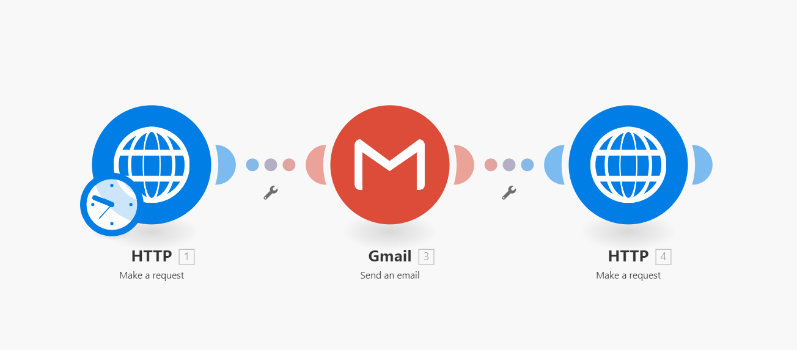

# Team-Charlie
***

***
Authors:   
Nico Heiniger   
Gabriel Massaro  
Rinson Mankudiyil  
Hsaine El-Ali  
*** 
## Table of Content
1. [Introduction](#introduction)
2. [Project Description](#projectdescription)
	1. [The Web Page](#thewebpage)
	2. [Camunda](#camunda)
	3. [Integromat](#integromat)
	4. [Lager](#lager)
	5. [Billing](#billing)
3. [Step by Step](#step-by-step)
***

## Introduction
In 2020 the COVID pandemic took everyone by surprise, forcing countries to close their borders and instore new restrictions and policies. Businesses had to adapt by quickly finding ways to work remotely due to lockdowns. The pandemic has really affected everybody, especially the elderly and people in the risk category.  

How would the people with chronic illnesses, who are now at risk each time they venture outside, get their medication?  

The Digital Pharmacy is a project that aims to provide a general solution to small and medium-size pharmacies in implementing online purchasing. By enabling customers to purchase their prescription-based and over-the-counter medication safely from home. This would help remove risks associated with COVID. In addition, it would allow pharmacies to expand their customer base.
***

## Project Description
This project aims to showcase how an online shopping solution could be implemented for digital pharmacies.  

### *The Web Page*
The first thing is to create an interface for customers to interact with. It is easiest done via a Webpage or an application. In our project, we decided to create a Webpage. The customer will be able to open it via the web browser, select the desired medications and input all the information necessary.  

Using HTML, React JS with some styling from Bootstrap CSS, we created a simple Demo version of the Digital Pharmacy.  

The primary function of the web page is to select the drugs and collect relevant data, such as email address etc., necessary to complete the whole process. All information about the drugs is contained in a data table implemented with AirTables. The AirTable is linked to the web page and acts as a back-end database.  

This way, it is easy for any employee to add or remove a certain drug. In addition, it allows to specify which drug is sellable over the counter and which ones need a prescription from a doctor.  

After selecting the desired medications, some personal information will be required in order to complete the order.

### *Camunda*
The whole business process was described using BPML in the Camunda modeler. The customer will start the process by completing an order on the web page, as shown in the previous section.  

Next, the order will be received by an employee of the pharmacy. At this stage, it is essential to know if the medication ordered is prescription based or over-the-counter. A DMN table has been implemented on the following drug assessment process step, in which all the drugs are annotated as prescription or over-the-counter, to verify if a prescription is needed or not. This way, the process can decide which way it will follow.  

The DMN table is integrated into the "Drug Assessment" task.  The drug name variable value is forwarded from the Digital Pharmacy webpage order form once it is filled out and submitted by a customer. The value will be retrieved from the order and validated with the DMN table to verify if a prescription is needed or if it is an over-the-counter drug that is ordered. The validated value is forwarded to the "Type of Order" gateway as an output value. The corresponding flow will be taken based on the validated output value configured in the following two flow paths going from the gateway.  

If the drug is prescription-based, the process will follow the upper path, and the next step will request the customer to provide a prescription. (See next section). If the medication is over-the-counter, the order will move forward without requesting additional documents.

### *Integromat*
As mentioned previously, if the drug needs a prescription, then an email must be sent to the customer requesting to provide it in PDF format. For this purpose, we have decided to use Integromat. This platform allows us to generate an email that will be sent to the email address provided by the customer.  

Integromat serves another important purpose. It periodically scans the mailbox of the digital pharmacy for any new emails containing PDF documents. It then stores them on Google drive and saves in Google Sheets the Name, Date, Medicine and Email. When the information is received, then it sends the notification to Camunda.  

When the customer has provided the prescription, Camunda will receive a request to be manually validated by an employee.  

### *Lager*
After receiving the prescription and manual confirmation, the process will be transferred to the Lager. The employee at the station will be requested to manually pack the order displayed to him and confirm its readiness.  

When confirmed, the process will once again redirect to Intregromat to updates the stock in the AirTables.

### *Billing*
The final step of the process is to send the final confirmation to the customer that includes the bill. This step is done via Integromat, which sends an email to the customer's email address.  
***

## Step by Step

1. The customer orders medication using the Web Page:  
	1. Web page is created Using HTML, React JS. 
	2. With some styling from Bootstrap CSS.
	3. The information regarding all the drugs available for order is stored in a data table and implemented using AirTables.

	During the order, the customer will provide his email and other relevant data.
	
2. The order is received by the pharmacy, and the process is started:  
	1. The order is received by an employee of the pharmacy.
	2. Depending on the type of drug (prescription or OTC), different routes will be used, this decision is taken referring to a DMN table created with Camunda.
	3. If the drug needs a prescription, it will request it from the customer in PDF format by sending a request to the provided email address. This step is implemented using Integromat.
	
3. The customer replies to the email, attaching his prescription in PDF format:  
	1. Integromat recognises the incoming email.
	2. Saves the PDF file in Google Drive.
	3. Saves essential data in Google Sheets.
	
4. When this step is successfully completed it notifies Camunda that the process can proceed by requesting an employee of the pharmacy to confirm it manually. The manual request is a check box created using Camunda forms.

5. The next step will be executed in the Storage or lager section of the pharmacy. An employee will have to manually pack the order and confirm when it is ready. 

6. When the order is ready, a notification will be sent to Integromat to update the inventory by decreasing the stock by one in the AirTables.

7. Finally, the final step is to notify the customer that his order has been sent and provide him with an invoice. The email is automatically sent through Integromat.
***